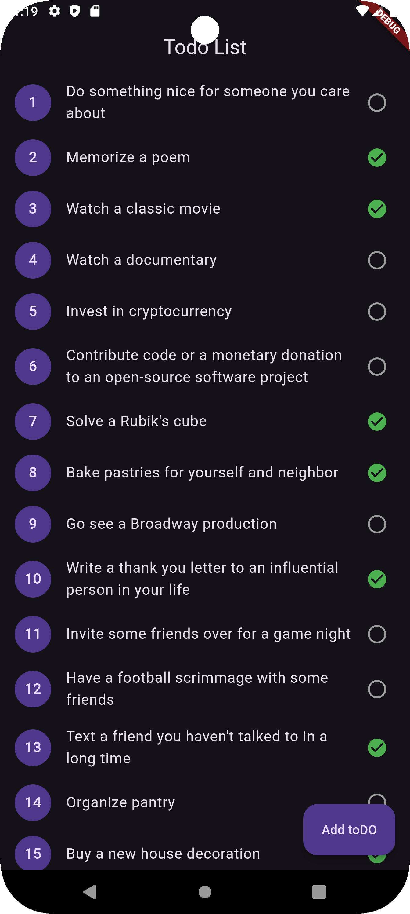

# TodoApp with GetX

This is a simple Todo List application built using Flutter and GetX for state management. It fetches data from a dummy API and allows you to manage your tasks.

## Features

- Fetch tasks from a dummy API (https://dummyjson.com/todos).
- Display tasks in a list view.
- Mark tasks as completed or not.
- Add new tasks to the list.




## Installation

1. Clone this repository:
   ```bash
   git clone https://github.com/Zoohaa-Shahbaz/todoapp_getx.git
